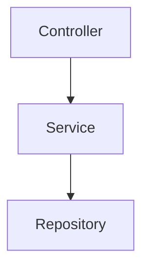

这是一个适合 AI Coding 的路线图。我把它设计成 **12 个里程碑**，每个里程碑结束都应该：

```text
代码可运行
+
Git提交
+
文档更新
```

不要跨阶段开发。

---

# 项目总目标

项目：

```text
OpenSource Analyst Agent
```

输入：

```text
Github仓库地址
```

输出：

```text
项目简介
技术栈分析
架构分析
学习路线
面试知识点
```

最终技术栈：

```text
Python
FastAPI
LangGraph
Multi-Agent
MCP
Chroma
PostgreSQL
OpenAI Compatible API
```

---

# Milestone 0：环境准备

目标：

开发环境能跑起来。

## 完成内容

安装：

```text
Python 3.12+

uv

Git

VSCode 或 Cursor/Trae
```

创建项目：

```bash
uv init opensource-analyst-agent
```

建立仓库：

```text
opensource-analyst-agent/
```

提交：

```text
init project
```

---

# Milestone 1：项目设计文档

目标：

先设计，后编码。

## 产出

```text
docs/

PRD.md

ARCHITECTURE.md

ROADMAP.md
```

PRD内容：

```text
用户是谁

解决什么问题

输入是什么

输出是什么
```

---

ARCHITECTURE内容：

```text
整体架构图

Agent关系

数据流
```

---

完成标准

```text
能够用一张图解释项目
```

---

# Milestone 2：GitHub 仓库读取

目标：

输入仓库URL获得信息。

## 功能

输入：

```text
https://github.com/xxx/xxx
```

获得：

```text
README

目录结构

语言统计
```

---

模块

```text
src/github/
```

---

完成标准

接口返回：

```json
{
  "readme":"...",
  "languages":{}
}
```

---

# Milestone 3：单Agent分析

目标：

项目第一次具备价值。

## 功能

分析：

```text
README
```

输出：

```text
项目介绍

技术栈

适用场景
```

---

模块

```text
src/llm/
```

---

完成标准

接口：

```text
POST /analyze
```

返回分析结果。

---

# Milestone 4：Repository RAG

目标：

不再只看 README。

## 功能

读取：

```text
README

docs

src

配置文件
```

建立知识库。

---

模块

```text
src/rag/
```

---

完成标准

用户提问：

```text
这个项目如何实现Tool Calling？
```

系统能引用仓库内容回答。

---

# Milestone 5：FastAPI接口完善

目标：

形成完整后端。

## 接口

```text
POST /analyze

POST /chat

GET /task/{id}
```

---

完成标准

Swagger可访问。

---

# Milestone 6：LangGraph Workflow

这是第一道门槛。

---

目标：

从单次调用升级为流程。

## State

```python
GraphState
```

字段：

```text
repo_url

summary

architecture

dependency

learning_path
```

---

节点

```text
LoadRepoNode

AnalyzeNode

ArchitectureNode

LearningNode
```

---

流程

```text
LoadRepo
↓
Analyze
↓
Architecture
↓
Learning
```

---

完成标准

能够画出 LangGraph 流程图。

---

# Milestone 7：Dependency Agent

目标：

第一个专家Agent。

## 分析

```text
pom.xml

requirements.txt

package.json
```

输出：

```text
技术栈

依赖作用

核心框架
```

---

完成标准

Agent单独运行。

---

# Milestone 8：Architecture Agent

这是项目核心。

## 功能

分析：

```text
目录结构

模块职责

入口文件
```

输出：

```text
架构说明
```

---

完成标准

能够解释：

```text
项目有哪些模块

模块之间如何协作
```

---

# Milestone 9：Learning Agent

目标：

生成学习路线。

输出：

```text
Step1

Step2

Step3
```

例如：

```text
先读README

再读核心模块

最后读Workflow
```

---

完成标准

陌生项目也能生成路线。

---

# Milestone 10：Coordinator Agent

真正进入 Multi-Agent。

---

职责：

```text
任务拆分

Agent调度

结果汇总
```

---

结构

```text
Coordinator

├── RepoAgent

├── DependencyAgent

├── ArchitectureAgent

└── LearningAgent
```

---

完成标准

用户只发一次请求。

多个Agent自动协作。

---

# Milestone 11：MCP 接入

第二道门槛。

---

接入：

## GitHub MCP

读取：

```text
Issue

PR

Release
```

---

接入：

## Filesystem MCP

读取：

```text
本地代码
```

---

接入：

## Browser MCP

搜索：

```text
官方文档

博客

论文
```

---

完成标准

Agent能够调用 MCP Tool。

---

# Milestone 12：高级分析能力

项目亮点阶段。

---

## Mermaid图生成

输出：



---

## Interview Agent

生成：

```text
面试高频知识点

源码阅读重点

常见问题
```

---

## Reflection

检查分析结果是否完整。

不完整：

```text
重新分析
```

---

完成标准

形成闭环 Workflow。

---

# 最终目录

```text
opensource-analyst-agent

docs/

src/

├── api/

├── agents/
│
├── graph/
│
├── rag/
│
├── github/
│
├── mcp/
│
├── prompts/
│
├── vectorstore/
│
├── models/
│
└── tests/
```

---

# 开发顺序（严格按这个来）

```text
M0 环境

↓
M1 设计文档

↓
M2 GitHub读取

↓
M3 单Agent分析

↓
M4 Repository RAG

↓
M5 FastAPI

↓
M6 LangGraph

↓
M7 Dependency Agent

↓
M8 Architecture Agent

↓
M9 Learning Agent

↓
M10 Coordinator Agent

↓
M11 MCP

↓
M12 高级能力
```

后面你每完成一个里程碑，比如说：

```text
我做到 Milestone 4 了
```

或者：

```text
我现在开始做 Milestone 6
```

我就可以直接进入导师模式，给你：

- 当前阶段需要掌握的知识
    
- 给 AI Coding 工具的提示词
    
- 目录结构设计
    
- 验收标准
    
- 常见坑点
    
- Git 提交粒度
    

直到把这一阶段完成。